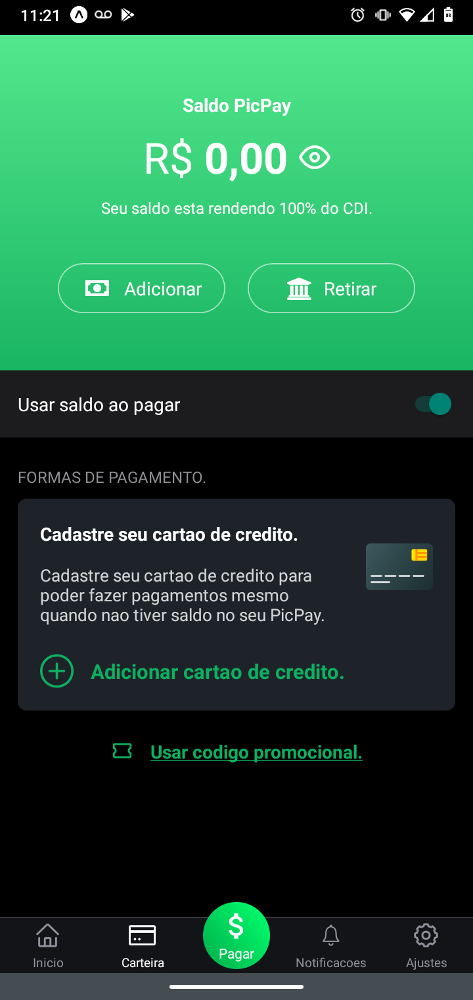

## Sobre o projeto

PicPay fake - .

Projeto desenvolvido pelas aulas disponiveis no [YouTube][yt] oferecida pelo [Mateus Silva][mt].

## Layout

  

  

## Tecnologias

As seguintes ferramentas usadas na criação do projeto:

- [Expo][expo]
- [Node.js][nodejs]
- [React][reactjs]
- [React Native][rn]

[yt]: https://www.youtube.com/watch?v=0CraBZHejKI
[mt]: https://github.com/maateusilva/picpay-clone
[nodejs]: https://nodejs.org/
[expo]: https://expo.io/
[reactjs]: https://reactjs.org
[rn]: https://facebook.github.io/react-native/